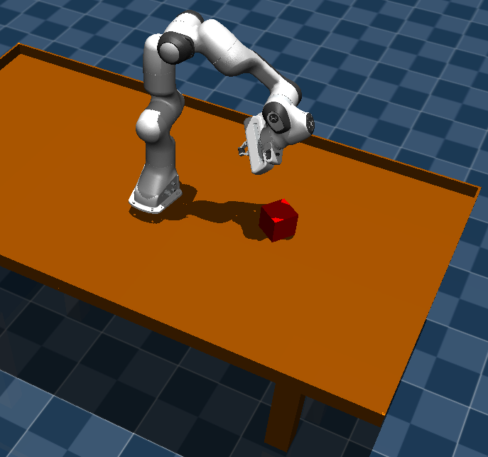
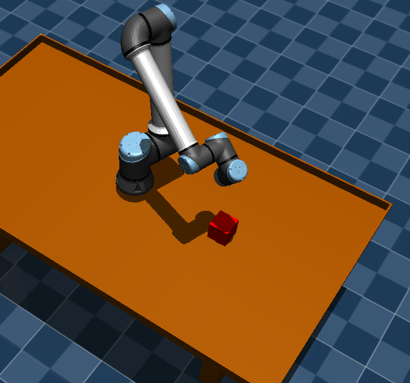

# mujoco_sandbox
Small projects to test mujoco

Projects
--------
1. [Basic Tracking](basic_tracking/) : Beginner project to load either a UR10 or Panda arm and track the 3D position of a small cube on a table. User can move the cube with keyboard.

|  |  |
